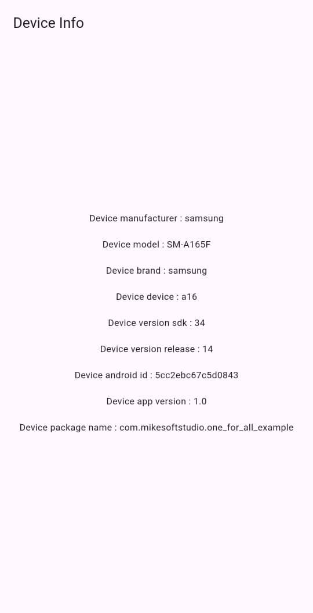

# Screenshots

This document contains screenshots demonstrating the usage and UI of the `one_for_all_platform` Flutter plugin on supported platforms.

---

## Android

---

## iOS

---

> Place your screenshot images in the `screenshots/` directory at the root of the project. Update the image file names above as needed to match your actual screenshots.
